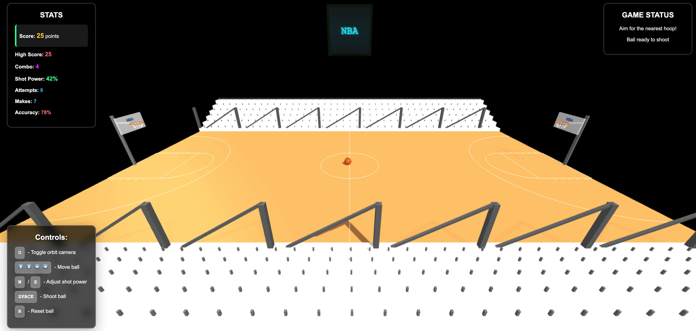
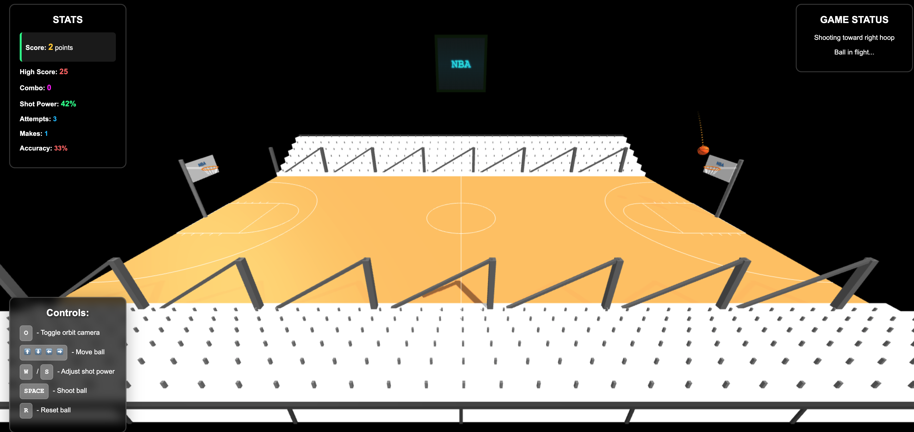
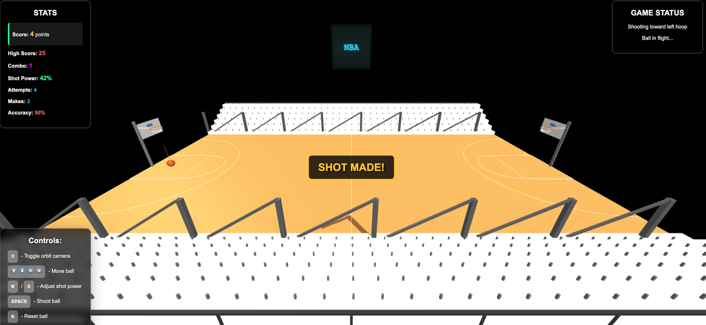
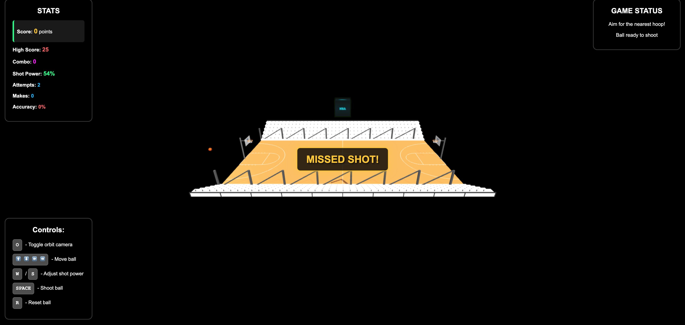

# Computer Graphics - Exercise 6 - WebGL Basketball Court

## Getting Started
1. Clone this repository to your local machine
2. Make sure you have Node.js installed
3. Start the local web server: `node index.js`
4. Open your browser and go to http://localhost:8000

## Complete Instructions
**All detailed instructions, requirements, and specifications can be found in:**
`basketball_exercise_instructions.html`

## Group Members
**MANDATORY: Add the full names of all group members here:**
- Yuval Moscovitz
- Omri Weinstein

## Group Members ID's
- Yuval Moscovitz: 322632100
- Omri Weinstein: 211895495

## Technical Details
- Run the server with: `node index.js`
- Access at http://localhost:8000 in your web browser

## Screenshots

## Additional Features
- Sound
- High Score (with local storage)
- Combo
- Multiple Hoops
- Ball Trail Effects
- Advanced Physics

